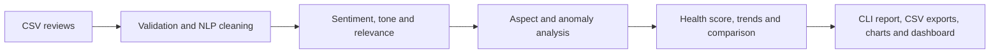

# AI Product Intelligence & Decision Support System

An explainable, local Python platform that turns unstructured product reviews into decision-ready product health, aspect-level insights, anomaly signals, trends, and recommendations. It evolved from the Smart Product Review Analyzer without replacing its core data-cleaning, sentiment, tone, relevance, export, and chart workflow.

## Problem and solution

Star ratings alone do not explain *why* a product succeeds or fails. Delivery complaints can unfairly hurt a product, while a mixed review can hide an excellent camera and a weak battery. This project separates product and service feedback, evaluates aspects independently, and produces a transparent **Product Health Score** rather than a black-box conclusion.



## Key features

- Backward-compatible CSV ingestion: only `Review_Text` and `Star_Rating` are required.
- Text cleaning with NLTK tokenization, stop-word removal, and lemmatization.
- TextBlob polarity, subjectivity, sentiment confidence, and rule-assisted tone detection.
- Aspect-based analysis for Battery, Camera, Performance, Display, Design, Build Quality, Durability, Audio, Comfort, Software, Features, Price, and service aspects.
- Product/service category separation. Service-only reviews are preserved but receive only 10% product-score weight.
- TF-IDF + cosine-similarity anomaly signals for near duplicates, plus concise text-pattern signals. These are **suspicious reviews**, not claims of fake reviews.
- Configurable Product Health Score, top strengths/concerns, emerging-issue alerts, competitor comparison, optional price-to-value scoring, and priority-based personalized recommendations.
- Command-line pipeline and Streamlit dashboard.

## Product Health Score

The scoring configuration is centralized in `config.py`:

| Component | Weight |
|---|---:|
| Relevant review sentiment | 40% |
| Star rating | 30% |
| Relevant review ratio | 15% |
| Verified purchase ratio | 10% |
| Anomaly-adjusted sentiment confidence | 5% |

An anomalous review remains visible but its influence is reduced. Recommendation bands are: 85–100 `STRONG BUY`, 70–84 `BUY`, 55–69 `CONSIDER`, 40–54 `CAUTION`, and below 40 `AVOID`.

## Installation and use

Python 3.10+ is recommended.

```powershell
python -m pip install -r requirements.txt
python main.py sample_product_reviews.csv
```

The first run may download the small NLTK `stopwords` and `wordnet` corpora. To launch the dashboard:

```powershell
streamlit run app.py
```

## Dataset format

Required columns:

```text
Review_Text,Star_Rating
```

Optional columns: `Review_ID`, `Product_Name`, `Date`, `Verified_Purchase`, `Price`, and `Sentiment_Label`. Existing legacy `review,sentiment` sample files remain supported. Missing optional data is assigned a safe default; invalid review text/rating rows are excluded with clear validation errors.

## Outputs

- `output/processed_reviews.csv` — cleaned text, sentiment, tone, categories, aspects, anomaly signals, weights, and health recommendation.
- `output/product_summary.csv` — health components and alerts.
- `output/aspect_health_scores.csv` — aspect scores and mention shares.
- `output/product_comparison.csv` — comparison across `Product_Name` values; value score is added only when price data exists.
- `output/recommendation_explanation.csv` — traceable reasons and concerns.
- `graphs/` — professional review, aspect, trend, anomaly, comparison, and correlation charts.

## Interview talking points and limitations

The system favors local, explainable NLP over paid APIs or opaque large language models. TextBlob and rule-based aspect matching are lightweight and transparent, but they may miss sarcasm, domain-specific vocabulary, and nuanced negation. Future improvements include a labeled domain model, multilingual support, reviewer-level behavioral features, a test suite, and optional Azure deployment—none are required to run the local project.
